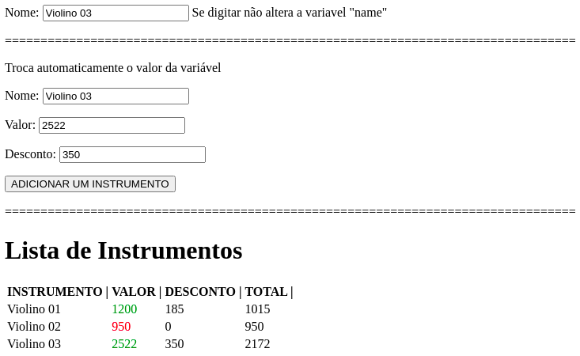

# PROJETO ANGULAR BÁSICO

Alguns tópicos essenciais para o desenvolvimento em Angular


1. Criação de componentes
```
ng g component NOME_DO_COMPONENTE
```
2. Data Binding / Two way data binding
3. Disparando eventos
4. Propriedades reativas
5. Mostrar ou esconder elementos
6. Camada de serviços
7. Gerando aplicação de produção.
```
ng build
```





### Os commits do projeto serão realizados de acordo com os tópicos anteriores